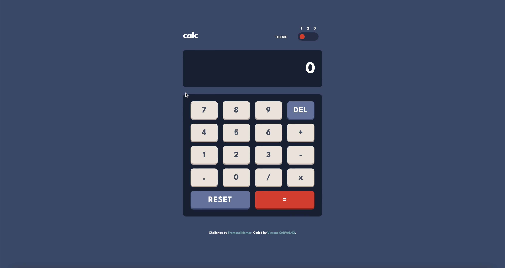

# Frontend Mentor - Calculator app solution

This is a solution to the [Calculator app challenge on Frontend Mentor](https://www.frontendmentor.io/challenges/calculator-app-9lteq5N29). Frontend Mentor challenges help you improve your coding skills by building realistic projects. 

## Table of contents

- [Overview](#overview)
  - [The challenge](#the-challenge)
  - [Screenshot](#screenshot)
  - [Links](#links)
- [My process](#my-process)
  - [Built with](#built-with)
  - [What I learned](#what-i-learned)
  - [Continued development](#continued-development)
  - [Useful resources](#useful-resources)
- [Author](#author)
- [Acknowledgments](#acknowledgments)


## Overview

### The challenge

Users should be able to:

- See the size of the elements adjust based on their device's screen size
- Perform mathmatical operations like addition, subtraction, multiplication, and division
- Adjust the color theme based on their preference
- **Bonus**: Have their initial theme preference checked using `prefers-color-scheme` and have any additional changes saved in the browser

### Screenshot



### Links

- Solution URL: [https://github.com/CarvalhoVincent/calculator-app]
- Live Site URL: [https://carvalhovincent.github.io/calculator-app/]

## My process

### Built with

- Semantic HTML5 markup
- CSS custom properties
- Flexbox
- CSS Grid
- Mobile-first workflow
- Javascript


### What I learned

The more I learned in this project is in JavaScript, with lot of loops, the ```js try {} catch {} ``` statement, the ```js eval()``` method, and ```js  Math.round((final + Number.EPSILON)```
I worked faster with HTML and CSS, like with GRID, placing different things, and responsive.


### Continued development

I want to continue focusing on JavaScript in future projects, as well as my HTML and CSS skills.


### Useful resources

- [https://www.w3schools.com] - Used it for some reminders about CSS and JS.
- [https://stackoverflow.com/] - Used it for the toggle switch, it helps me cause I was stuck at this point. And also for the calculator part

## Author

- Frontend Mentor - [@CarvalhoVincent](https://www.frontendmentor.io/profile/CarvalhoVincent)


## Acknowledgments

https://stackoverflow.com/questions/67729844/how-to-make-a-3-button-sliding-toggle-switch
https://stackoverflow.com/users/15171903/deegee

This user deegee post a great solution for the toggle switch, it helps me a lot to do it !
